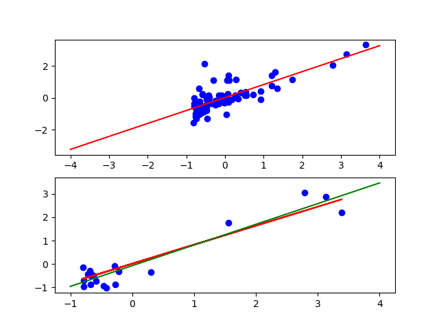
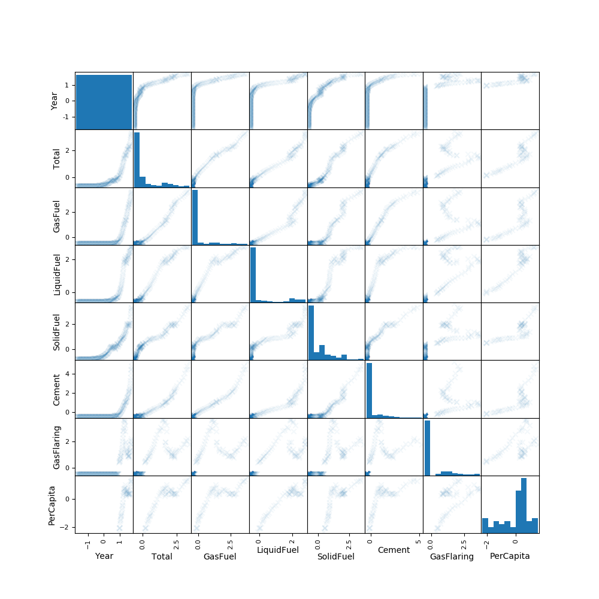
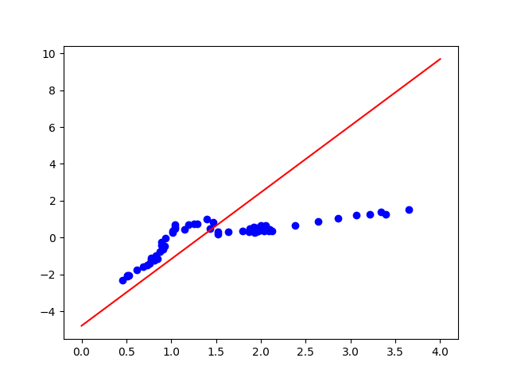
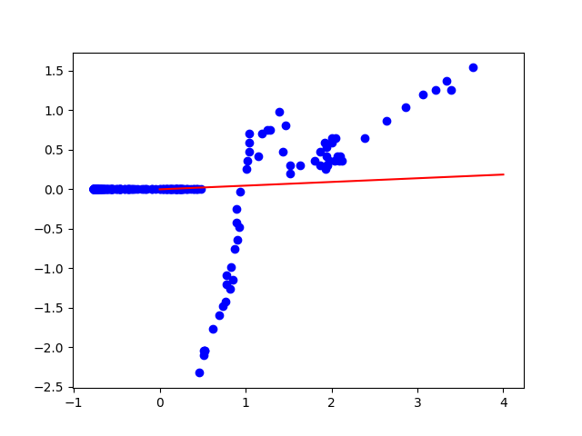
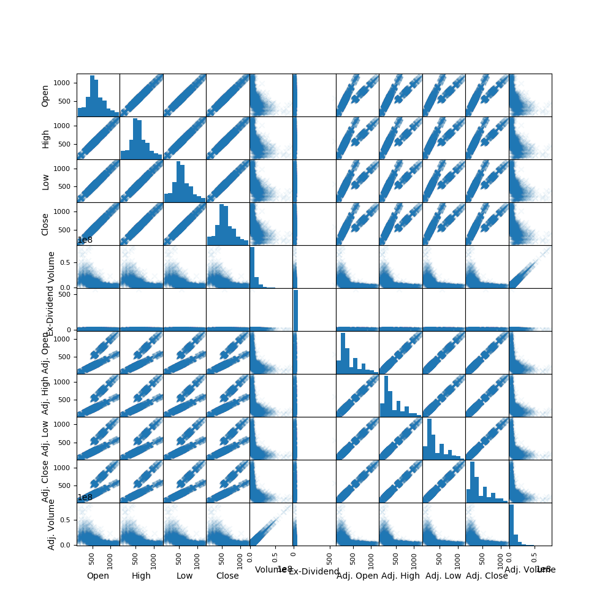
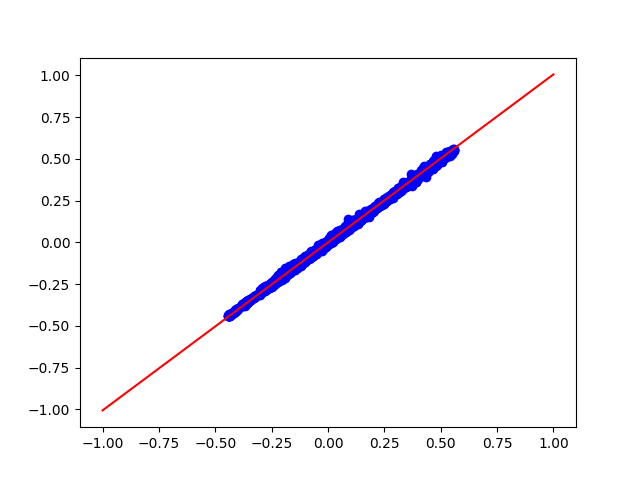
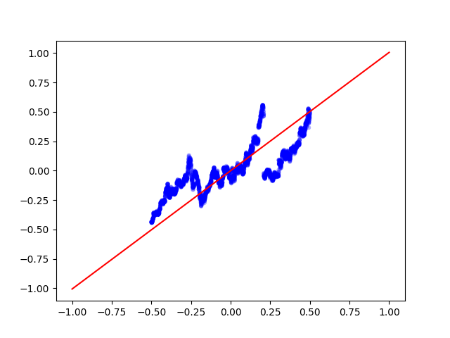

Вариант III (Challenge Dataset)
==
Загрузим необходимые пакеты:
```python
import numpy as np
import pandas as pd
import patsy as pt
from sklearn import preprocessing
import sklearn.linear_model as lm
import matplotlib.pyplot as plt
from pandas.plotting import scatter_matrix
from datetime  import datetime
import quandl
from sklearn.model_selection import train_test_split
```
challenge_dataset.txt
==
Загрузим датасет challenge_dataset.txt:
```python
df = pd.read_csv(r"challenge_dataset.txt")
```
Стандартизуем данные:
```python
df = (df - df.mean()) / df.std()
```
Разделим данные на обучающую(80%) и тестовую(20%) выборки:
```python
train, test = train_test_split(df, test_size=0.2)
```
Построим график из точек:
```python
plt.subplot(211)
plt.plot(x, y, 'go', color = 'blue')
```
Построим простую линейную регрессию y от x:
```python
  x = df.iloc[:,:-1]
  y = df.iloc[:,-1]

  pt_y, pt_x = pt.dmatrices("y ~ x", df)
  res = np.linalg.lstsq(pt_x, pt_y)
  b = res[0].ravel()
```
Нарисуем полученную линию:
```python
  x2 = np.linspace(-4, 4, 100)
  f1 = b[0] + b[1] * x2 
  ax.plot(x2, f1, color = 'red')
```
Отдельно нарисуем нашу линию с набором тестовых данных:
```python
plt.subplot(212)
plt.plot(x_test, y_test, 'go', color = 'blue')
f2 = b[0] + b[1] * x_test
plt.plot(x_test, f2, color = 'red')
```
Проверим на переобучение:
```python
pt_y, pt_x = pt.dmatrices("y_test ~ x_test", test)
res = np.linalg.lstsq(pt_x, pt_y)
b = res[0].ravel()

x2 = np.linspace(-1, 4, 100)
f1 = b[0] + b[1] * x2 
plt.plot(x2, f1, color = 'green')
```
На верхнем графике: красная линия - полученная по тестовой выборке линия, синие точки - точки обучающей выборки; на нижнем: красная линия - полученная по тестовой выборке линия, синие точки - точки тестовой выбоки, зеленая линия - истинная линия для тестовой выборки.



Линии почти параллельны, значит возможно некоторое переобучение.

Чтобы поэксперементировать с методами обработки ситуации с неопределенностью значения признака, рассмотрим датасет

global_co2.csv
==
Загрузим датасет и стандартизуем данные:
```python
df = pd.read_csv(r"global_co2.csv")
df = (df - df.mean()) / df.std()
```
Построим scatter matrix для загруженных данных:
```python
scatter_matrix(df, alpha=0.05, figsize=(10, 10), marker ='x')
```


Будем предсказать параметр "Per capita" по "Year". В "Per capita" есть пропуски, сначала  попробуем вычеркнуть строки с ними:
```python
df2 = df.dropna(axis=0)
x2 = df2.iloc[:,:-1]
y2 = df2.iloc[:,-1]
```
Построим регрессию:
```python
pt_y, pt_x = pt.dmatrices("PerCapita ~ Year", df2)
res = np.linalg.lstsq(pt_x, pt_y)
b0 = res[0].ravel()
print ("Cross off rows with NAN (PC ~ Year) ", b0)
```
Отобразим результаты:
```python
ax = plt.subplot()
ax.plot(df2['SolidFuel'], df2['PerCapita'], 'go', color = 'blue')#x[x]
asix_x = np.linspace(0, 4, 100)
f = b0[0] + b0[1] * asix_x 
ax.plot(asix_x, f, color = 'red')
```


Теперь проделаем ту же работу, но попробуем заполнить пропуски средними значениями признака:
```python
df3 = df.fillna(df['PerCapita'].mean())
x3 = df3.iloc[:,:-1]
y3 = df3.iloc[:,-1]

pt_y, pt_x = pt.dmatrices("PerCapita ~ Year", df3)
res = np.linalg.lstsq(pt_x, pt_y)
b0 = res[0].ravel()
print ("Fill NAN with median  (PC ~ Year) ", b0)

ax = plt.subplot()
ax.plot(df3['SolidFuel'], df3['PerCapita'], 'go', color = 'blue')#x[x]
asix_x = np.linspace(0, 4, 100)
f = b0[0] + b0[1] * asix_x 
ax.plot(asix_x, f, color = 'red')
```


Как видно, для нашего набора данных лучше вычеркивать строки с неопределенными значениями, чем заполнять средним значением. Так получается, потому что пропуски есть только в начальной части данных (для небольших Year).

Построим вектор коэфициентов линейной регрессии PerCapita от всех остальных:
```python
pt_y, pt_x = pt.dmatrices("y2 ~ x2", df2)
res = np.linalg.lstsq(pt_x, pt_y)
b2 = res[0].ravel()
print ("Cross off rows with NAN ", b2)

pt_y, pt_x = pt.dmatrices("y3 ~ x3", df3)
res = np.linalg.lstsq(pt_x, pt_y)
b3 = res[0].ravel()
print ("Fill NAN with median ", b3)
```
Получим:

Cross off rows with NAN  [ -4.70354648e+00   1.85368108e+00   3.64128788e+01  -6.66053900e+00
  -1.45951858e+01  -1.28346405e+01  -1.81101647e+00   1.96421936e-03]
  
Fill NAN with median  [ -4.08659474e-16   7.02343534e-02  -1.47997739e+01  -3.24039292e-01
   9.11631050e+00   4.88094615e+00   2.15695575e+00  -6.66431764e-01]

WIKI/GOOGL
==
Загрузим датасет, удалим  и заменим даты на количество дней с начала торгов и нормализуем данные:

```python
df = quandl.get("WIKI/GOOGL")
del df['Split Ratio']

df['Date'] = pd.to_datetime(df['Date'])
df['Date'] = df['Date'] - df['Date'][0]
df['Date'] = df['Date'].dt.days
dfn = (df - df.mean()) / (df.max() - df.min())
```

Построим scatter_matrix, чтобы увидеть зависимости:
```python
ax = plt.subplot()
scatter_matrix(df, alpha=0.05, figsize=(10, 10), marker ='x')
```


Построим линейную зависимость Close от Open:
```python
pt_y, pt_x = pt.dmatrices("Close ~ Open", dfn)
res = np.linalg.lstsq(pt_x, pt_y)
b0 = res[0].ravel()
print ("Close ~ Open ", b0))
```
Построим линейную зависимость Close от Date:
```python
pt_y, pt_x = pt.dmatrices("Close ~ Open", dfn)
res = np.linalg.lstsq(pt_x, pt_y)
b0 = res[0].ravel()
print ("Close ~ Open ", b0))
```


Построим график:
```python
ax.plot(dfn['Close'], dfn['Open'], 'go', color = 'blue')#x[x]
axis_x = np.linspace(-1, 1, 100)
f = b0[0] + b0[1] * axis_x 
ax.plot(axis_x, f, color = 'red')
```


Построим график линейной зависимости Close от Date:
```python
pt_y, pt_x = pt.dmatrices("Close ~ Date", dfn)
res = np.linalg.lstsq(pt_x, pt_y)
b0 = res[0].ravel()
axis_x = np.linspace(-1, 1, 100)
f = b0[0] + b0[1] * axis_x
ax.plot(axis_x, f, color = 'red')
```


Найдем вектор коофициентов линейной зависимости Adj. Volume от остальных признаков:
```python
x = dfn.iloc[:,:-1]
y = dfn.iloc[:,-1]

pt_y, pt_x = pt.dmatrices("y ~ x", dfn)
res = np.linalg.lstsq(pt_x, pt_y)
b1 = res[0].ravel()
print ("Adj. Volume ~ <Others> ", b1)
```
Adj. Volume ~ <Others>  [  3.79854903e-18   2.55654872e-16  -4.56014756e-15   2.82719269e-15
   8.51217968e-15  -6.61824111e-15   1.00000000e+00   1.66910489e-17
   1.44795200e-16  -5.41382802e-16   6.28728840e-16  -5.14155775e-16]


