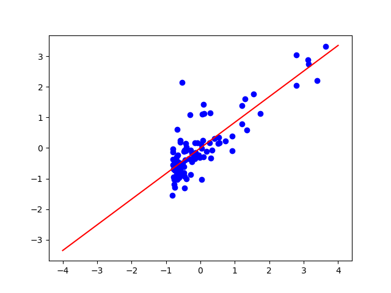

challenge_dataset.txt
==
Загрузим датасет challenge_dataset.txt:
'''sh
  df = pd.read_csv(r"challenge_dataset.txt")
'''
стандартизуем данные:

  df = pd.read_csv(r"challenge_dataset.txt")

построим график:

  ax = plt.subplot()
  ax.plot(x, y, 'go', color = 'blue')
  plt.show()

Для этих данных построим простую линейную регрессию y от x

  x = df.iloc[:,:-1]
  y = df.iloc[:,-1]

  pt_y, pt_x = pt.dmatrices("y ~ x", df)
  res = np.linalg.lstsq(pt_x, pt_y)
  b = res[0].ravel()

построим полученную линию 

  x2 = np.linspace(-4, 4, 100)
  f1 = b[0] + b[1] * x2 
  ax.plot(x2, f1, color = 'red')

