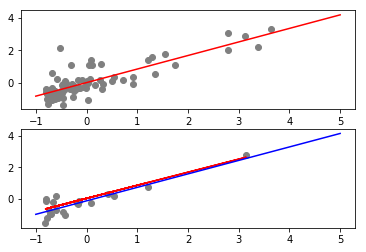

Вариант III (Challenge Dataset)
==
Для начала необходимо загрузить необходимые пакеты и прочитать данные:
```python
import numpy as np
import pandas as pd
import patsy as pt
import sklearn.linear_model as lm
from sklearn.model_selection import train_test_split
import matplotlib.pyplot as plt

df = pd.read_csv(r"challenge_dataset.txt")
```
challenge_dataset.txt
==
Далее приведем данные к стандартному виду:
```python
df = (df - df.mean()) / df.std()
```
Разделим данные на обучающую(75%) и тестовую(25%) выборку:
```python
train, test = train_test_split(df, test_size=0.25)
```
Графическое изображение данных:
```python
plt.subplot(211)
plt.plot(x, y, 'go', color = 'gray')
```
Линейная регрессия y по x:
```python
  x = df.iloc[:,:-1]
  y = df.iloc[:,-1]

  pt_y, pt_x = pt.dmatrices("y ~ x", df)
  res = np.linalg.lstsq(pt_x, pt_y)
  b = res[0].ravel()
```
Получим линию:
```python
  x2 = np.linspace(-1, 4, 100)
  f1 = b[0] + b[1] * x2 
  ax.plot(x2, f1, color = 'red')
```
Отдельно нарисуем нашу линию с набором тестовых данных:
```python
plt.subplot(212)
plt.plot(x_test, y_test, 'go', color = 'gray')
f2 = b[0] + b[1] * x_test
plt.plot(x_test, f2, color = 'red')
```
Проверка на переобучение:
```python
pt_y, pt_x = pt.dmatrices("y_test ~ x_test", test)
res = np.linalg.lstsq(pt_x, pt_y)
b = res[0].ravel()

x2 = np.linspace(-1, 4, 100)
f1 = b[0] + b[1] * x2 
plt.plot(x2, f1, color = 'blue')
```
На верхнем графике: красная линия - полученная по тестовой выборке линия, серые точки - точки обучающей выборки; на нижнем: красная линия - полученная по тестовой выборке линия, серые точки - точки тестовой выбоки, синяя линия - истинная линия для тестовой выборки.



Линии почти параллельны, а это значит, что возможно некоторое переобучение.
